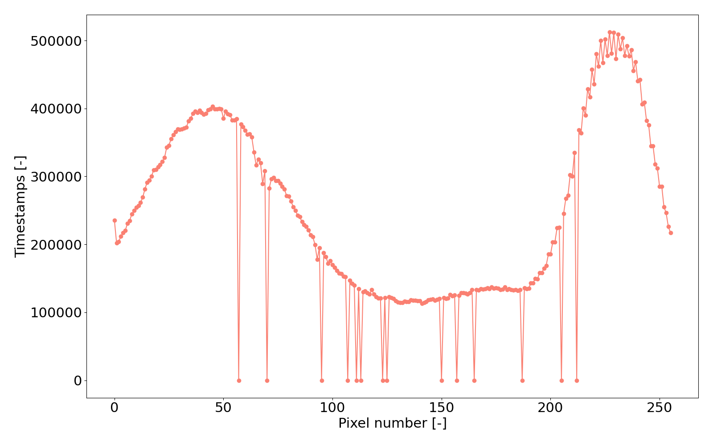

# Examples

## Unpacking the binary output of LinoSPAD2

The key functions of this package are the ones from the unpack.py module that
allow unpacking binary-encoded timestamp-output data from LinoSPAD2
into matrices with dimensions 'pixel number X timestamps'
(firmware version 2208) or 'TDC number x timestamps' (firmware version
2212). LinoSPAD2 exchanges 32-bit words with a PC, whereas lower 28 bits
(0-27) are the timestamp, and bits 28-29 are the pixel address in the given
TDC (note the TDC-pixel interconnection in the given firmware version),
bit 30 is unused and the MSB is the validity bit ('1' for valid).

Invalid timestamps are written as '-1' to avoid confusion with actual
timestamps of 0 ps. At the end of each cycle, a '-2' is inserted that
is utilized in calculations of timestamp differences, avoiding the
comparison of timestamps from different cycles and data files.

Because of a somewhat elaborate way the timestamps are encoded in the
firmware version 2212, the actual shape of the output is a 3D matrix,
where the first axis is the 64 TDCs, the second axis is timestamps*cycles+cycles
(all timestamps + '-2's inserted), and the third axis is the timestamps themselves along with the pixel number in the given TDC.
In the firmware version 2212, there are two versions - 'block' and 'skip'.
In the block version, pixels 0, 1, 2, and 3 are connected to TDC 0, pixels
4, 5, 6, 7 - to TDC 1, and so on. So, to get the actual pixel position
in the array of 256 pixels, the following equation can be used:

$$P_{\mathrm{sen}} = 4*T + P_{\mathrm{TDC}},$$

where $P_{\mathrm{sen}}$ is the pixel number in the sensor array with values from 0 to 255, $T$ is the TDC number and takes values from 0 to 63, and
$P_{\mathrm{TDC}}$ is the pixel number relative to the TDC with values
from 0 to 3. And for the skip version:

$$P_{\mathrm{sen}} = T + 64*P_{\mathrm{TDC}}.$$

### Example: unpacking binary data

When running the LinoSPAD2 data acquisition software, multiple options
are provided that affect the data output, such as the number of data
acquisition cycles, number of timestamps per pixel/TDC per cycle
recorded, clock, etc. In the scope of the functions provided by this
package, the most important ones are the number of timestamps and the
daughterboard number (used for applying correct masks for hot pixels and
for calibration data). For example, for a data file with the number of
timestamps of 200 and 20 cycles, the unpacking function would look like this:

```
from LinoSPAD2.functions.unpack import unpack_bin
data = unpack_bin(file, board_number="A5", timestamps=200)
```
where 'file' is the name of the data file. The shape of the resulting
matrix could be checked with numpy:
```
np.shape(data)
```
giving (64, 4020, 2) as the result, where the '2' refers to an array of
(pixel_number, timestamp). The data set was collected with 20 cycles per
file, so the total number of timestamps is 4000. However, at the end of
each cycle, a '-2' is inserted for later use, so the second axis of the
matrix is 4020 elements long.

## Plotting sensor population

The sensor population plot is very simple: the function 'plot_sen_pop'
from the 'plot_tsmp' module collects all valid timestamps in each pixel
across all datafiles in the given folder and plots it as a number of
timestamps vs. pixel number (256 total). The figure below is an example
of such a plot, where data were taken in a two-spectrometer setup
with an incandescent lamp as a source of light; a mask for hot pixels is
not applied, and pixels with 0 timestamps are most probably dead.
The plot is saved as a .png file in the 'results' folder in the same
directory where data files are.



## Plotting timestamp differences

Timestamp differences are calculated for pairs of pixels in the given
array of pixels' indices. The '-2's inserted during unpacking are used
here as indicators of separate cycles and timestamps from the same cycle
only are taken into account when comparing data from two pixels. The
function used for collecting timestamp differences is the
'delta_save' from the 'delta_t' module. The output is saved as a '.csv'
table - mainly because data analysis takes a long time and in the case a plot
needs to be redone, one does not have to wait for the analysis again
and may use the '.csv' file. The boolean parameter 'rewrite' should be
always provided for the function to work, with 'True' for rewriting the
'.csv' file in the case it already exists - this is to avoid losing
previously saved data, again due to the time-consuming data analysis.
The function 'delta_cp' from the same module is used to collect the data
from the '.csv' file and plot it as a grid of histograms for the given
pairs of pixels, see the figure below.


This is a typical result for the '2212b' (block) firmware version. The
dips in some of the pairs are due to the pixels being connected to the
same TDC, and as the TDC is busy with one of the pixels, others miss
photons so that there can't be pairs of photons with a time of arrival
between them lower than a certain value. On the other hand, peaks seen
in some of the other pairs are due to optical cross-talk between the
neighboring pixels. Because of that, it is advised to use pixels separated
with ~20 pixels in between them to avoid cross-talk.

## Fitting timestamp differences with a Gaussian function

To extract useful information from a histogram of timestamp differences,
a Gaussian fit of the histogram could be done. For this, the function
'fit_wg' (fit with Gaussian) from the module 'fits' can be used. As the
data input, the '.csv' file with all timestamp differences is used (see
previous section). The fit is done via 'curve_fit' of the 'scipy.optimize'
package. The parameters of the fit provide information on the
average background signal and the signal-to-noise ratio as visibility,
along with the timing resolution (the sigma parameter), and the
expected value is the position of the peak (if there's one). In the
example below, a histogram of timestamp differences for pixels 3 and 45
is fitted with a Gaussian function.


## Cross-talk analysis

For cross-talk analysis, an ambient source of light that covers the
whole sensor homogenically (while avoiding read-out saturation) could be
used. For this, the module 'cross_talk' could be used, with functions
'collect_ct' (similar to 'delta_save') and
'plot_ct' (plot cross-talk; similar to 'delta_cp'). Again, the outputs of
both functions (a '.csv' file for the first one, a '.png' - for the second)
are saved in the same directory where data files are. For LinoSPAD2,
the estimated cross-talk is at 0.2% for the neighboring pixels, with
even lower numbers for the farther pixels.

## Calibration

Same as for cross-talk analysis, for calibrating the TDC nonlinearities
and the offset of the peak in timestamp differences plots could be
done using an ambient light source. In the first case, the actual
bin sizes of the 140-bit TDC code are calculated based on the statistics
of the population registered in each pixel. In the second, the response
delay of each pixel is registered and later used to compensate for the
offset in the histograms of timestamp differences. Function
'calibrate_save' and 'calibrate_load' from the 'calibrate' module can be
used. The first one collects all the data and saves it into a '.csv' file,
whereas the second one loads this data during unpacking of the
experimental data. The calibration data for LinoSPAD2 daughterboards
"A5" and "NL11" (along with masks for hot pixels) can be found in the
"params" folder in the repository of this project.
